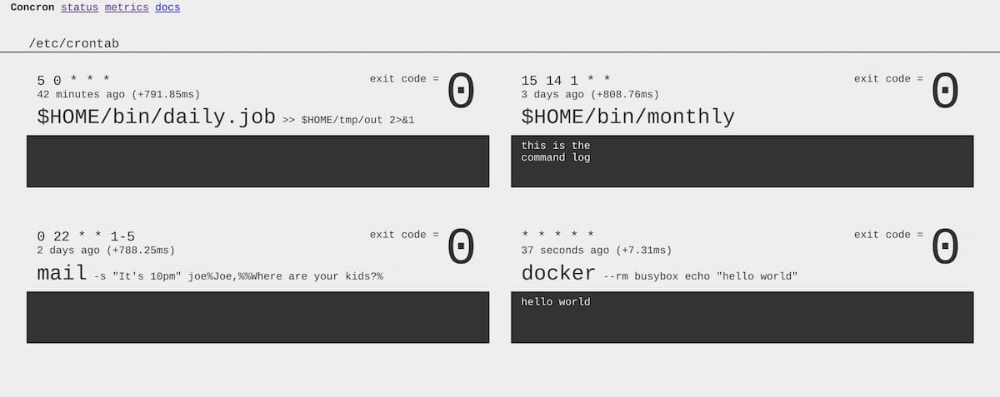

Concron - Cron for Container
============================

- :heavy_check_mark: Dashboard included.
- :heavy_check_mark: Prometheus/OpenMetrics exporter included.


## Quickstart

### via Docker command

Place your crontab file to `./crontab`, and run the below command.

``` shell
$ docker run -v $(pwd)/crontab:/etc/crontab:ro -p 8000:80 ghcr.io/macrat/concron:latest
```

### via Docker Compose

You can make `docker-compose.yml` like below,

``` yaml
version: "3"

services:
  concron:
    image: ghcr.io/macrat/concron:latest
    environment:
      CRON_TZ: Asia/Tokyo
      CONCRON_CRONTAB: |
        45 */3 * * *  *  docker run --rm busybox echo "you can do your task here!"
    volumes:
      - /var/run/docker.sock:/var/run/docker.sock
      - ./cron-files:/etc/cron.d:ro
    ports:
      - "8000:80"
    restart: always
```

And then, start via `docker-compose up -d` command.

More examples are in [examples directory](./examples).

### without container

You can just start `crontab` command.

``` shell
$ export CRONTAB_PATH=/etc/crontab:/etc/cron.d CRONTAB_LISTEN=":8000"  # These are default values.

$ crontab
```


## Image variants

- `latest`, `docker`: Based on [Docker](https://hub.docker.com/_/docker) image. To run Docker containers. This image supports less architectures than others.
- `busybox`: Minimal image based on [Busybox (glibc)](https://hub.docker.com/_/busybox). To execute simple shell scripts or your own binaries.
- `slim`: Based on [Debian slim](https://hub.docker.com/_/debian) image. To execute complex scripts or programs that can not execute on busybox image.

All images are generated by [the same Dockerfile](./Dockerfile).


## Crontab

Concron searches crontab files from `/etc/crontab` or under the `/etc/cron.d`.
These path is specified by `CONCRON_PATH` environment variable.
In the container, you can also use `CONCRON_CRONTAB` environment variable instead of file.

In Windows, Concron searches `C:\crontab`, `C:\cron.d`, `C:\%USERPROFILE%\crontab`, and `C:\%USERPROFILE%\cron.d`.

Crontab file is like below.

``` crontab
SHELL=/bin/sh
CRON_TZ=Asia/Tokyo

#    schedule     user        command
# |------------| |----| |-----------------|
   */10 * * * *   root   echo your-command

   @daily         *      echo another command
```

This file format is the same as common crontab with user name column.
But there is single difference; you can use `*` as username that means execute on the same user as the execution user of Concron.

The container has users that have the same name as UID, 1000 to 1010.
So you can use specify UID in crontab like `1000` as user name.

Concron uses `/bin/sh -c` in Unix, `%COMSPEC% /C` in Windows, to execute command.
You can change shell using `SHELL` and `SHELL_OPTS`.
`SHELL` is `/bin/sh` or `%COMSPEC%` part, and `SHELL_OPTS` is `-c` or `/C` part.

In below example, all tasks will executed in the docker container.

``` crontab
# This is too long and ugly.
0 0 * * *  *  /usr/bin/docker run --rm busybox echo hello world


# Use docker command as a shell.
SHELL = /usr/bin/docker
SHELL_OPTS = run --rm
PARSE_COMMAND = yes

# This is short and cool!
0 0 * * *  *  busybox echo hello world
```

When the `PARSE_COMMAND` option in above example is enabled, Concron executes comannd as `"/usr/bin/docker" "run" "--rm" "busybox" "echo" "hello" "world"` instead of `"/usr/bin/docker" "run" "--rm" "busybox echo hello world"`.
This option is useful if you want to use non-shell program as `SHELL`.


## Dashboard

You can see dashboard on <http://localhost:8000> in default.
The listen address can change using `CONCRON_LISTEN` environment variable.




## Metrics and Logging

The metrics for Prometheus in the OpenMetrics format is on <http://localhost:8000/metrics>.
This listen address can change using `CONCRON_LISTEN` environment variable as the same as the address of dashboard.

In default, log level set to `info`.
If you want get more information, please set `debug` to `CONCRON_LOGLEVEL`. Or, you can set `warn` or `error` to suppress log.

The Concron only writes log to the stdout.
Please collect them using container engine's log collector or something.


## Health check

Concron has 3 endpoints to check the status.

`/healthz` and `/livez` always return 200 OK while Concron running.

`/readyz` returns 200 OK while Concron is running and ready to execute tasks.
Otherwise, it returns 503 Service Unavailable. For example, before done to load all tasks, or after receive interrupt signal.
